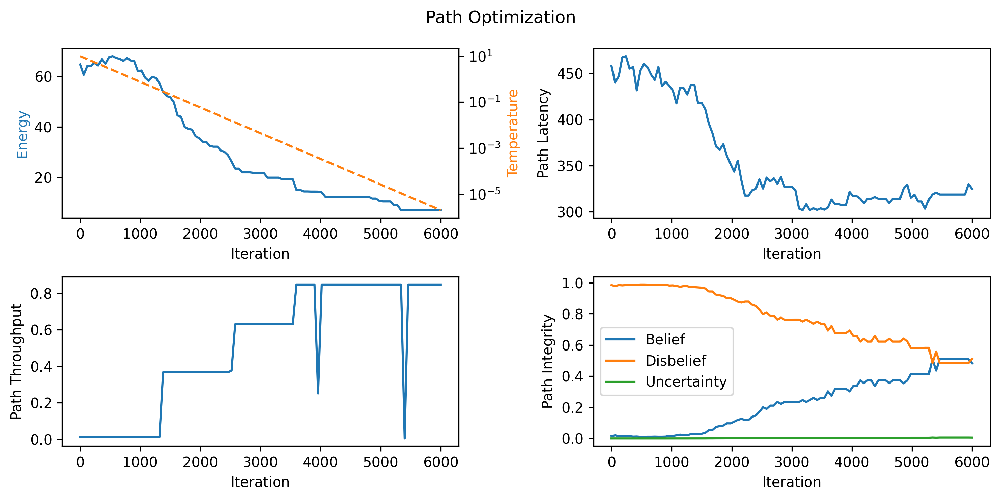

# Path Optimization on Multi-Weighted Graph

This is a toy implementation for an optimizer which solves the optimal path
problem on a graph where each edge has multiple weights.

## Different types of weights

Each edge in the graph can hold any number of weights representing different network metrics.
These weights can be of the usual types, such as foats or integers, or any user-defined types.
They do not need to be additive quantities, as long as we can define a method of **aggregation** for them, i.e.
a way to "add" them up to get a single value for the whole path.

In the current implementation, three types of weights are used, for demonstration purposes:
- **Latency**: real number. Aggregation method: *sum*.
- **Throughput**: real number. Aggregation method: *minimum*.
- **Integrity**: binomial opinion. Aggregation method: *binomial multiplication* as defined in the **subjective logic**.

### Binomial opinions

In subjective logic, an opinion is a formal representation of uncertain belief.
It expresses the belief, disbelief, and uncertainty about a proposition. An
opinion is defined as a tuple of three real numbers $\omega = (b, d, u)$, where $b$ is
the belief, $d$ is the disbelief, and $u$ is the uncertainty. Each number is in
the range $[0, 1]$ and they sum up to 1, i.e. $b + d + u = 1$.

We can combine multiple opinions using the **binomial multiplication**
operation $\omega_x ∧ \omega_y$, which is defined as follows:

$b_{x∧y} = b_x b_y + \frac{b_x u_y + b_y u_x}{3}$

$d_{x∧y} = d_x + d_y - d_x d_y$

$u_{x∧y} = 1 - b_{x∧y} - d_{x∧y}$

## Optimization using Simulated Annealing

In order to find the optimal path, we use a **simulated annealing** algorithm.
First, we need to define a cost function or **energy** which we want to minimize.

### Cost function

For this purpose, we define a weighted sum of the three weights:

$$
E = \alpha \text{LatencyCost}({\text{path}}) + \beta \text{ThroughputCost}({\text{path}}) + \gamma \text{IntegrityCost}({\text{path}})
$$

Where, for each type of weight, we obtain the value for the whole path by using
the aggregation operator defined above. The parameters $\alpha$, $\beta$, and
$\gamma$ are chosen empirically to balance each metric, and their sign
determines whether we want to minimize or maximize the metric.

Specifically for the integrity metric, the total integrity opinion is computed
by aggregating each edge's integrity opinion using the binomial multiplication
operator. The integrity cost is then computed as: $\text{logit}(b) = \log(\frac{b}{1-b})$,
where $b$ is the belief of the aggregated integrity opinion.

### Annealing steps

The simulated annealing algorithm starts with an initial path and iteratively
modifies it to find a better one. At each step, a new path is generated by
slightly modifying the current path. The modification is done by randomly selecting
one of three kinds of operations:
- REPLACE: Given a segment $s \rightarrow m \rightarrow t$, if $m' \in N(s) \cap N(t)$, replace segment with $s \rightarrow m' \rightarrow t$.
- INSERT: Given a segment $s \rightarrow t$, if $m \in N(s) \cap N(t)$, replace segment with $s \rightarrow m \rightarrow t$.
- BYPASS: Given a segment $s \rightarrow m \rightarrow t$, if $s \in N(t)$, replace segment with $s \rightarrow t$.

### Results

In order to test the algorithm, we use a random graph with $n=100$ nodes and edge probability $p=0.2$.
Weights of each type are randomly assigned to each edge.
We then run the simulated annealing algorithm for 6000 iterations, starting from a random path, using
the parameters $\alpha = 0.005$, $\beta = -10$, and $\gamma = -10$. Notice the signs of the parameters:
we want to minimize latency, maximize throughput, and maximize integrity belief.
The results are displayed in the figure below.

